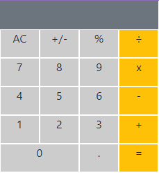

# Math Magicians

This is the "Math magicians" project, is basically a calculator created with react and CSS.



## Built With

- React & CSS

## Instalation

To get a local copy up and running follow these simple example steps.
- Open terminal
- Clone this project by command git clone https://github.com/marcosmerida/math-magicians.git
- cd to project folder
- ```npm update```
- ```npm start```

### Prerequisites

- IDE to edit and run the code (I've used Visual Studio Code 🔥).
- Node

### Usage

- For anyone who wants to practice React and CSS.
- Implementation of React set up.

## Authors

👤 **Juan Marcos Mérida**

- GitHub: [@githubhandle](https://github.com/marcosmerida)
- LinkedIn: [LinkedIn](https://linkedin.com/in/marcos-merida-219437206/)

## Show your support

Give a ⭐️ if you like this project!
